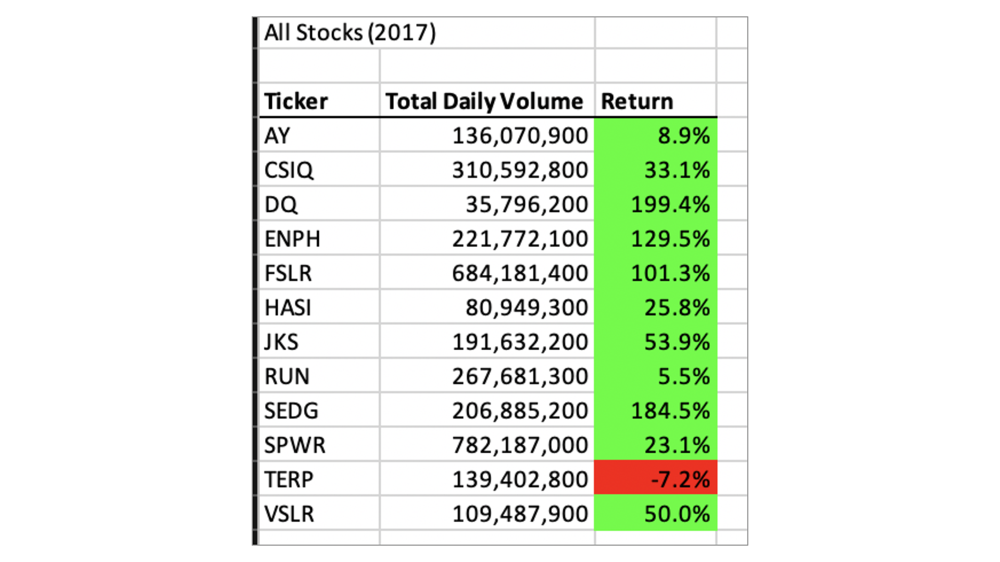

# Stock-Challenge

OVERVIEW: VBA Stock Analysis

### Purpose

-In this project and analyisis helping Steve and prepared for him.. I edited and created, the Stock Market with VBA solution code to loop through all the data one time in  to collect. And I determined code successfully made the VBA script run faster.The VBA file in this repository can be used to analyize yearly stock data

  ## Analysis and Challenges
  - In 2018 stocks had a return generally than in 2018
  
  - Refactoring code helps run the code quicer.
   
  - Helps identify bughs in our inital code 

  -Prepare dataser VBA_Challenge.vbs file for the project.
 
  -Create folder in GitHub 
 
   What are the advantages or disadvantages of refactoring code?
   ## ADVANTAGE
   Logical errors easily appear in well structure code that contains nested conditionals and loops.
     
   ## DISADVANTAGE
   Refactoring process can affect the testing outcomes.
   
   ## Summary
     
   How do these pros and cons apply to refactoring the original VBA script?
   -Updating the code without changing the software’s functionality is known as code refactoring.
   -Use the steps Refactor VBA code and measure performance to add code where indicated by the numbered comments in the starter code file.

### Result

  We can run the stock all analysis, to confirm that our stock analysis outputs for 2017 and 2018 are the same as dataset example provided. You can see the final   Stock All Analysis Results Analysis 2017 and 2018 save the pop-up messages showing elapsed run time for the refactored code as 
 
 
